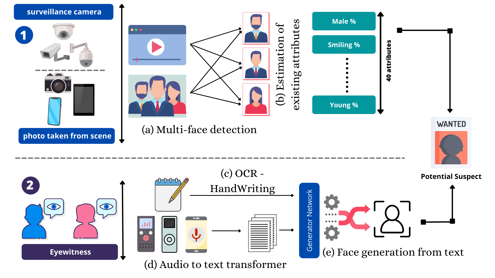
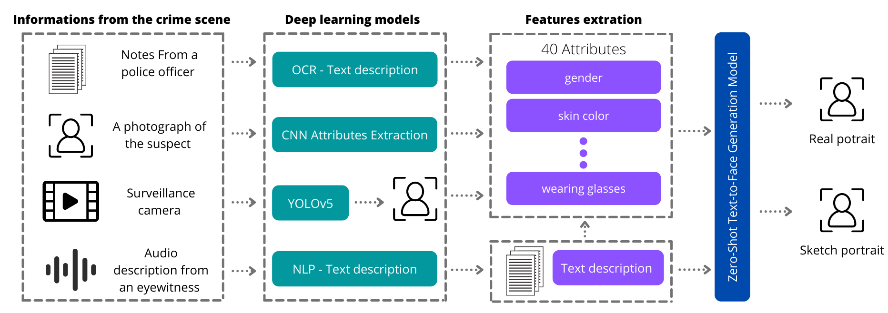
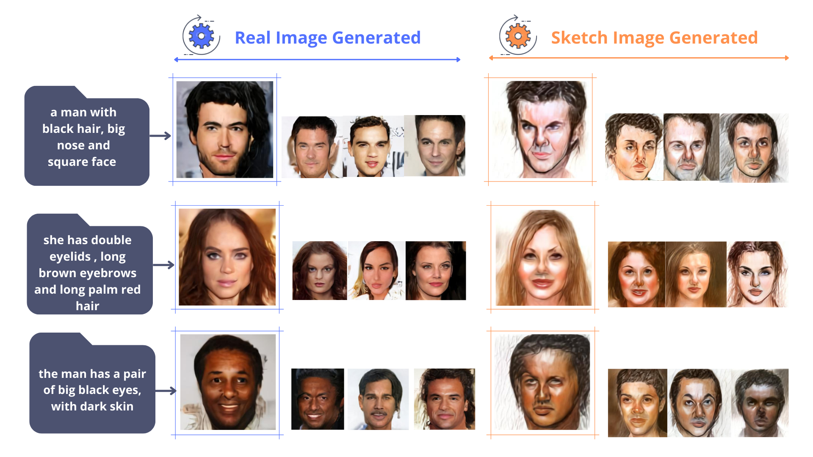

# DEEP LEARNING BASED GENERATION OF VIRTUAL FACES USING PORTRAIT SPECIFICATIONS

The goal of this repository is to create deep learning-based tools for generating human faces based on text description, following the methodology presented in the next images :





### result achieved so far



### cite our work

If you find Our repository useful in your research, please consider citing our paper:

```
@article{Berrahal2022,
author = {Berrahal, Mohammed and Azizi, Mostafa},
doi = {10.11591/IJEECS.V25.I2.PP972-979},
keywords = {Deep fusion,Deep fusion-GAN,Deep learning,GAN,Generative adversarial network,Portrait generation,Text-to-image synthesis},
title = {{Optimal text-to-image synthesis model for generating portrait images using generative adversarial network techniques}}
}
```

```
@inproceedings{Berrahal2022,
author = {Berrahal, Mohammed and Azizi, Mostafa},
doi = {10.1109/iraset52964.2022.9737845},
title = {{Improvement of facial attributes' estimation using Transfer Learning}},
}
```

```
@article{Berrahal2021,
author = {Berrahal, Mohammed and Azizi, Mostafa},
keywords = {CNN,Data augmentation,Deep learning,Face attributes,Face sketch image,Image classification,Multi,Multi-label learning,label learning},
title = {{Augmented binary multi-labeled CNN for practical facial attribute classification}},
url = {http://ijeecs.iaescore.com/index.php/IJEECS/article/view/24782},
}
```

```
@inproceedings{Berrahal2020,
author = {Berrahal, Mohammed and Azizi, Mostafa},
doi = {10.1109/ICDS50568.2020.9268710},
keywords = {Composite Face,Deep Learning,Generative Adversarial Networks,Image Generation,Sketch Face},
title = {{Review of DL-Based Generation Techniques of Augmented Images using Portraits Specification}},
}
```
