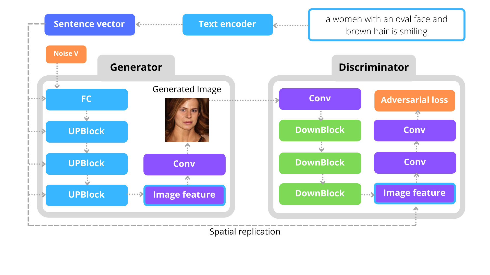

# AUTOMATIC GENERATION OF VIRTUAL IMAGES USING DEEP LEARNING BASED ON PORTRAIT SPECIFICATIONS


# DF-GAN: Deep Fusion Generative Adversarial Networks for Text-to-Image Synthesis




---
### Requirements
- python 3.6+
- Pytorch 1.0+
- easydict
- nltk
- scikit-image
- A titan xp (set nf=32 in *.yaml) or a V100 32GB (set nf=64 in *.yaml)
### Installation

Clone this repo.
```
git clone https://github.com/tobran/DF-GAN
cd DF-GAN/code/
```

### Datasets Preparation
1. Download the preprocessed metadata for [celeba](https://drive.google.com/open?id=1O_LtUP9sch09QH3s_EBAgLEctBQ5JBSJ) and save it to `data/`
2. Download the [celeba](http://www.vision.caltech.edu/visipedia/CUB-200-2011.html) image data. Extract them to `data/birds/`

### Pre-trained text encoder
1. Download the [pre-trained text encoder](https://drive.google.com/open?id=1GNUKjVeyWYBJ8hEU-yrfYQpDOkxEyP3V) for celeba and save it to `DAMSMencoders/celeba/`
---
### Training

**Train DF-GAN models:**
  - For celeba dataset: `python main.py --cfg cfg/celeba.yml`

- `*.yml` files are example configuration files for training/evaluation our models.

### Evaluating

**Dwonload Pretrained Model**
- [DF-GAN for celeba](https://drive.google.com/file/d/1svVTyKWj5B1J82rEiZILUS289DsmT6U7/view?usp=sharing). Download and save it to `models/celeba/`
- 
### Citing DF-GAN

If you find DF-GAN useful in your research, please consider citing our paper:

```
@article{Berrahal2022,
author = {Berrahal, Mohammed and Azizi, Mostafa},
doi = {10.11591/IJEECS.V25.I2.PP972-979},
journal = {Indonesian Journal of Electrical Engineering and Computer Science},
title = {{Optimal text-to-image synthesis model for generating portrait images using generative adversarial network techniques}},
url = {http://ijeecs.iaescore.com/index.php/IJEECS/article/view/26824}
}
```

**Reference**
- [DF-GAN: A Simple and Effective Baseline for Text-to-Image Synthesis](https://arxiv.org/abs/2008.05865) [[code]](https://github.com/tobran/DF-GAN)
- [StackGAN++: Realistic Image Synthesis with Stacked Generative Adversarial Networks](https://arxiv.org/abs/1710.10916) [[code]](https://github.com/hanzhanggit/StackGAN-v2)
- [AttnGAN: Fine-Grained Text to Image Generation with Attentional Generative Adversarial Networks](https://openaccess.thecvf.com/content_cvpr_2018/papers/Xu_AttnGAN_Fine-Grained_Text_CVPR_2018_paper.pdf) [[code]](https://github.com/taoxugit/AttnGAN)
- [DM-GAN: Realistic Image Synthesis with Stacked Generative Adversarial Networks](https://arxiv.org/abs/1904.01310) [[code]](https://github.com/MinfengZhu/DM-GAN)


